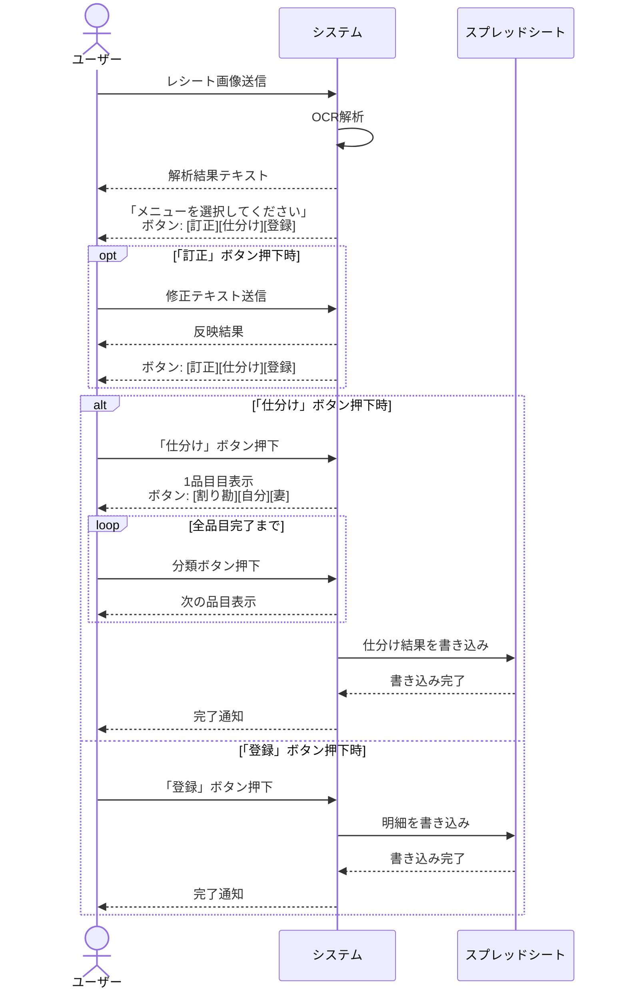
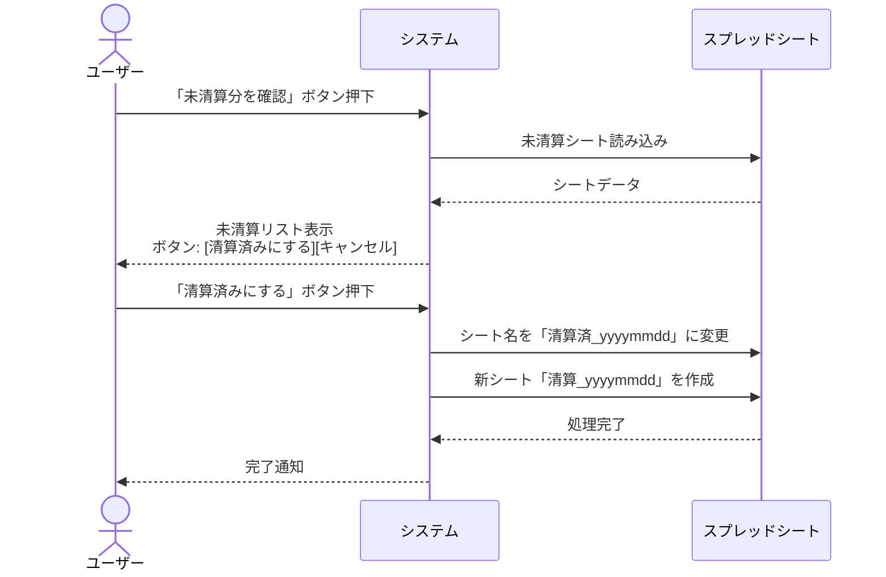

# 要件定義書（Requirements Definition）

## 1. 概要

### 1.1 目的
月次の家庭内清算（生活費の分担計算）を自動化・効率化するシステムを構築する。

### 1.2 解決する課題
| 課題 | 内容 | 採用案 |
|---|---|---|
| 問題点1 | 個別の金額計算（割り勘・単独負担の計算） | 案5 |
| 問題点2 | 清算金額の合計計算 | 案2 |
| 問題点3 | 内訳と合計の伝達 | 問題点2の案2で同時解決 |

---

## 2. 機能一覧

### 2.1 明細登録機能

| No | 機能名 | 概要 |
|---|---|---|
| F-01 | レシート画像送信 | ユーザーがLINEでレシート画像を送信 |
| F-02 | OCR明細解析 | Gemini 1.5 Flashで品目・金額を抽出 |
| F-03 | 明細解析結果表示 | 店名、日時、品目リスト、合計金額をテキスト表示 |
| F-04 | 明細金額訂正 | ユーザーがリストをコピペ編集して訂正 |
| F-05 | 品目仕分け | 各品目を「割り勘」「自分」「妻」に分類 |
| F-06 | 仕分け進捗可視化 | 仕分け中に全品目の進捗を絵文字で表示 |
| F-07 | キャンセル | 処理を中断し、処理中の一時データを破棄 |
| F-08 | 過去明細修正 | 過去のリストを送信して中断箇所から再開 |

### 2.2 清算スプレッドシート管理機能

| No | 機能名 | 概要 |
|---|---|---|
| F-09 | 未清算分確認 | リッチメニューから未清算シートの内容を表示 |
| F-10 | 清算確定 | 現在のシートを清算済みにし、新シートを作成 |
| F-11 | データ記録 | スプレッドシートに日時・店名・金額を記録 |

---

## 3. 業務フロー

### 3.1 明細登録フロー

### 3.2 清算確認フロー

---

## 4. データ仕様

### 4.1 スプレッドシート構成

| 項目 | 仕様 |
|---|---|
| ブック | 1ブックのみ |
| シート | 清算単位で作成 |
| シート名（未清算） | `清算_yyyymmdd` |
| シート名（清算済） | `清算済_yyyymmdd` |

### 4.2 シート列構成

| 列 | 項目 |
|---|---|
| A | 日時 |
| B | 店名 |
| C | 金額 |
| 最終行 | 合計 |

---

## 5. システム構成

| コンポーネント | 技術 |
|---|---|
| インターフェース | LINE公式アカウント |
| ワークフロー | n8n |
| OCR/AI | Gemini 1.5 Flash |
| データ保存 | Google スプレッドシート |

---

## 6. 画面一覧

| No | 画面名 | モック |
|---|---|---|
| 1 | 金額訂正フロー | line_ui_mockup_problem1_case3.html |
| 2 | 仕分け進捗表示 | line_ui_mockup_problem1_case4.html |
| 3 | キャンセル・再開 | line_ui_mockup_problem1_case5.html |
| 4 | 清算確認 | line_ui_mockup_problem2_case2.html |
