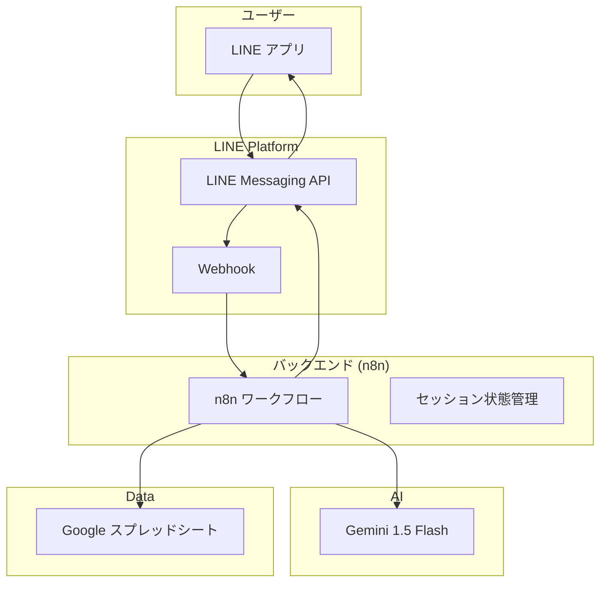
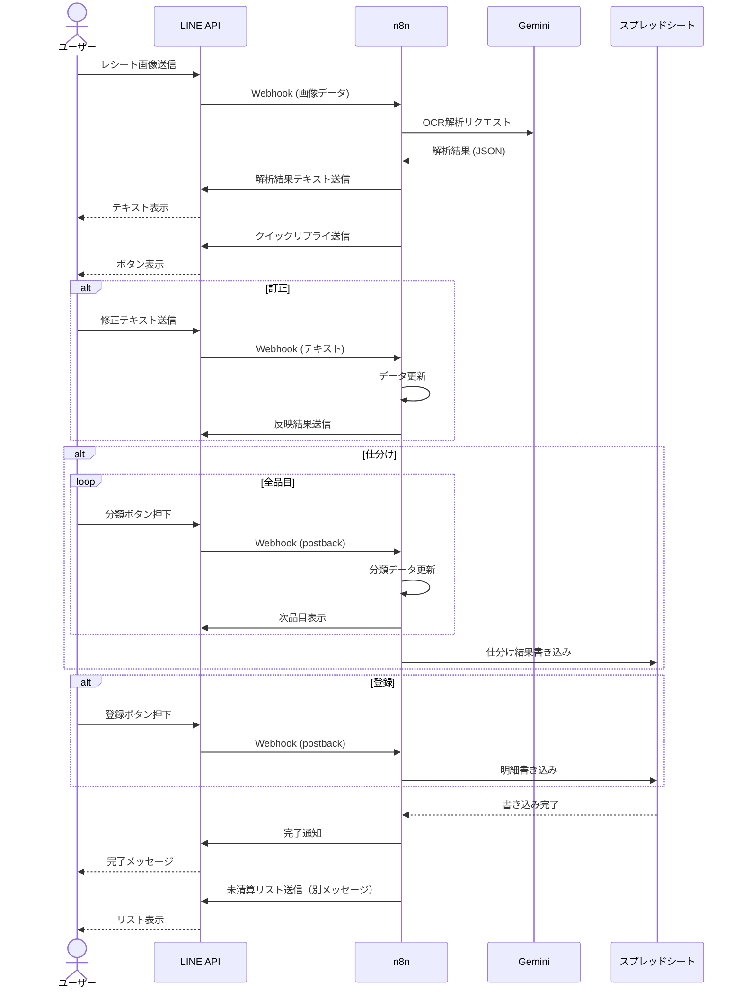
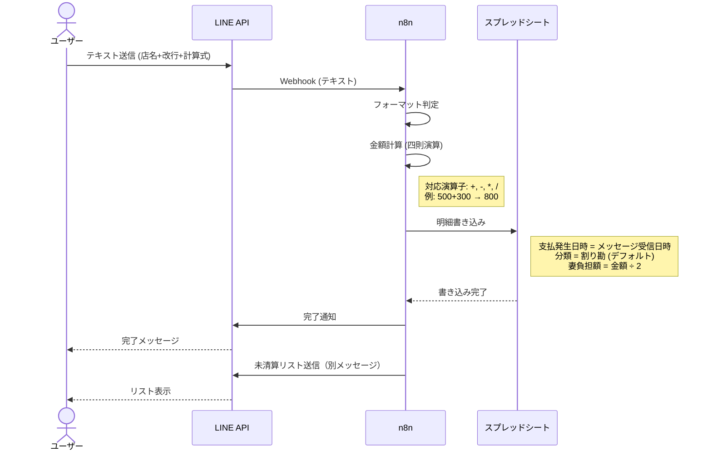
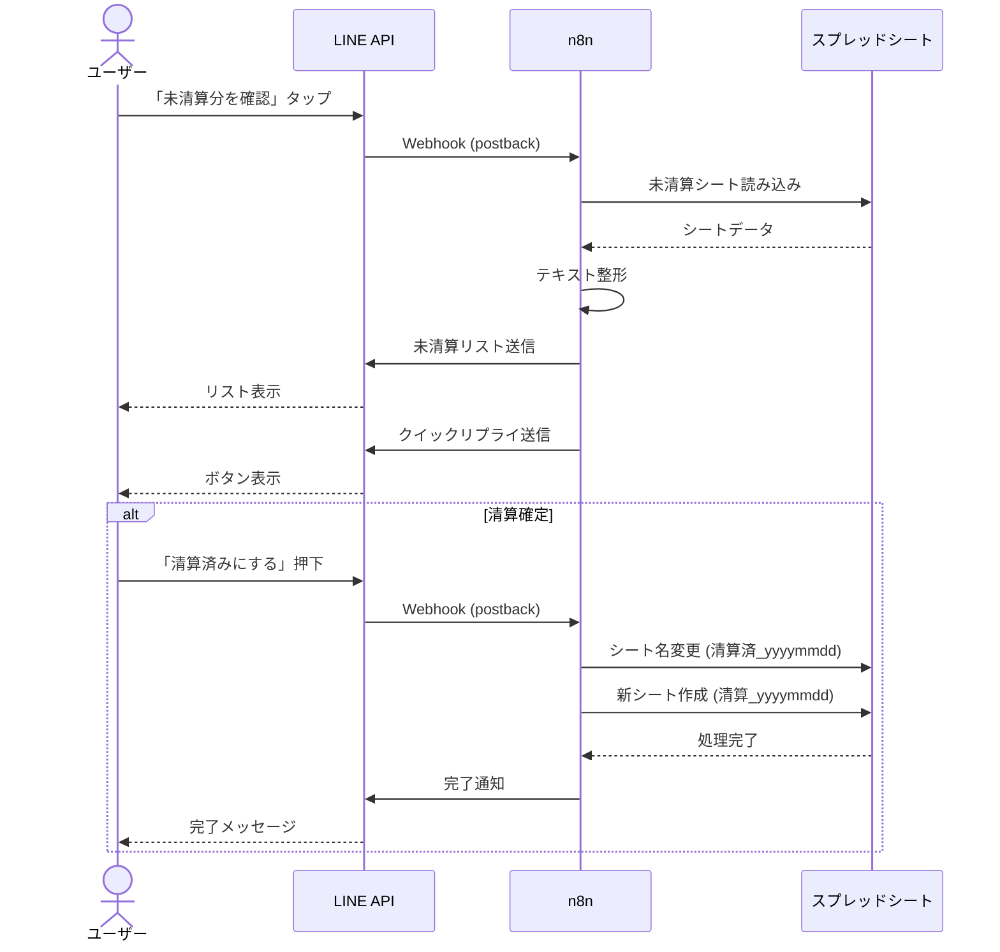

# 基本設計書（Basic Design）

## 1. システム構成

### 1.1 全体構成図



### 1.2 コンポーネント詳細

| コンポーネント | 技術/サービス | 役割 |
|---|---|---|
| LINE Messaging API | LINE公式アカウント | ユーザーインターフェース、メッセージ送受信 |
| n8n | セルフホスト or クラウド | ワークフロー制御、API連携 |
| Gemini 1.5 Flash | Google AI | OCR解析、テキスト構造化 |
| Google スプレッドシート | Google Workspace | データ永続化、集計 |

### 1.3 フロー一覧

| フロー名 | 概要 | トリガー |
|---|---|---|
| 明細登録フロー | レシート画像を解析し、品目ごとに負担者を分けて登録する（完了後、未清算リストを表示） | 画像送信、またはテキスト入力 |
| 個別登録フロー | 店名と金額（計算式可）を直接入力して登録する（完了後、未清算リストを表示） | LINEメッセージでテキスト入力（店名+改行+金額） |
| 清算確認フロー | 未清算分の総額と内訳を確認し、清算済み処理を行う | 「未清算分を確認」ボタン |

---

## 2. 画面設計

### 2.1 LINE リッチメニュー

| ボタン | アクション |
|---|---|
| 📋 未清算分を確認 | 未清算シートの内容をテキスト表示 |

### 2.2 モード一覧

ユーザー操作における各モードの定義は以下の通り。

| モード名 | 説明 | 移行条件 | 解除条件 |
|---|---|---|---|
| レシート登録モード | レシート解析結果が表示され、登録方法を選択する状態 | レシート画像送信 / テキスト入力 | 登録完了 / キャンセル |
| 仕分けモード | 品目ごとに「誰が支払うか」を順次選択していく状態 | [仕分け]ボタン押下 | 全品目完了 / キャンセル |
| 訂正モード | 解析結果のテキストを修正する状態 | [訂正]ボタン押下 | 修正完了（再解析） |
| 個別登録モード | 店名と金額を直接入力して登録する機能 | 所定フォーマット（店名＋改行＋金額）で入力 | 登録完了（即時） |

### 2.3 クイックリプライボタン一覧

| 画面 | ボタン | 説明 |
|---|---|---|
| 解析結果表示後 | [訂正] [仕分け] [全て割り勘で登録] | 訂正：テキスト修正、仕分け：品目別分類、全て割り勘で登録：全品目を割り勘で一括登録 |
| 仕分けモード | [🤝 割り勘] [🙋‍♂️ 自分] [🙋‍♀️ 妻] [❌ キャンセル] | 品目ごとに負担者を選択 |
| 未清算確認後 | [✅ 清算済みにする] [❌ キャンセル] | 清算確定でシート名を変更し新シート作成 |

### 2.4 画面項目一覧

| 画面 | 項目 | 説明 |
|---|---|---|
| メッセージ共通 | 支払発生日時 | 支払いの発生した日時 |
| メッセージ共通 | 店名 | 支払い先（レシートの店舗名など） |
| メッセージ共通 | 金額 | 支払総額、または品目ごとの金額 |
| 解析結果・仕分け | 品目名 | 購入した商品の名前 |
| 仕分け | 分類 | 誰が支払うかの状態（割り勘/自分/妻） |
| 未清算リスト | 妻負担額 | 妻が支払うべき金額 |
| 各画面共通 | 合計金額 | レシートごと、または未清算分の総額 |

### 2.5 メッセージフォーマット

#### 解析結果テキスト
```
スーパーABC
2024/12/27 10:30
----------------
品目A：500
品目B：300
品目C：200
----------------
合計：1,000
```

#### 仕分け進捗表示
```
スーパーABC
2024/12/27 10:30
----------------
🤝 品目A：500
➡️ 品目B：300
　 品目C：200
----------------
合計：1,000
```

#### 未清算リスト表示
```
【清算額内訳】

2024/12/20 スーパーABC
→ 1,500円

2024/12/22 ドラッグストアXYZ
→ 800円

────────────
合計：2,300円
```

---

## 3. データ設計

### 3.1 スプレッドシート構成

| 項目 | 仕様 |
|---|---|
| ブック名 | `家庭内清算` |
| ブック数 | 1ブックのみ |
| シート | 清算単位で動的作成 |

### 3.2 シート命名規則

| 状態 | シート名 | 例 |
|---|---|---|
| 未清算（アクティブ） | `清算_yyyymmdd` | 清算_20241227 |
| 清算済み | `清算済_yyyymmdd` | 清算済_20241227 |

### 3.3 シートレイアウト

| 行 | A列（支払発生日時） | B列（店名） | C列（金額） |
|---|---|---|---|
| 1 | **支払発生日時** | **店名** | **金額** |
| 2 | 2024/12/20 10:30 | スーパーABC | 1,500 |
| 3 | 2024/12/22 14:00 | ドラッグストアXYZ | 800 |
| ... | ... | ... | ... |
| 最終行 | | **合計** | =SUM(C2:C_n) |

---

## 4. シーケンス図

### 4.1 明細登録フロー



### 4.2 個別登録フロー



### 4.3 清算確認フロー



---

## 5. n8n ワークフロー設計

### 5.1 ワークフロー一覧

| No | ワークフロー名 | トリガー | 概要 |
|---|---|---|---|
| WF-01 | LINE Webhook Handler | LINE Webhook | メッセージ受信時のルーティング |
| WF-02 | Receipt OCR | WF-01 から呼び出し | 画像解析・テキスト化 |
| WF-03 | Item Classification | WF-01 から呼び出し | 品目仕分け処理 |
| WF-04 | Settlement Check | WF-01 から呼び出し | 未清算確認・清算確定 |

### 5.2 セッション状態管理

| 状態 | 説明 |
|---|---|
| `idle` | 待機中 |
| `ocr_done` | OCR完了、訂正/仕分け待ち |
| `classifying` | 仕分け中（品目index保持） |

---

## 6. API設計

### 6.1 LINE Messaging API

| エンドポイント | 用途 |
|---|---|
| `POST /v2/bot/message/reply` | リプライメッセージ送信 |
| `POST /v2/bot/message/push` | プッシュメッセージ送信 |
| `GET /v2/bot/message/{messageId}/content` | 画像コンテンツ取得 |

### 6.2 Gemini API

| エンドポイント | 用途 |
|---|---|
| `POST /v1/models/gemini-1.5-flash:generateContent` | OCR解析 |

### 6.3 Google Sheets API

| エンドポイント | 用途 |
|---|---|
| `GET /v4/spreadsheets/{id}/values/{range}` | シート読み込み |
| `POST /v4/spreadsheets/{id}/values/{range}:append` | 行追加 |
| `POST /v4/spreadsheets/{id}:batchUpdate` | シート名変更、新規作成 |
