# 基本設計書（Basic Design）

## 1. システム構成

### 1.1 全体構成図

```mermaid
graph TB
    subgraph ユーザー
        LINE[LINE アプリ]
    end

    subgraph LINE Platform
        LINEAPI[LINE Messaging API]
        WEBHOOK[Webhook]
    end

    subgraph Backend ["バックエンド (n8n)"]
        N8N[n8n ワークフロー]
        STATE[セッション状態管理]
    end

    subgraph AI
        GEMINI[Gemini 1.5 Flash]
    end

    subgraph Data
        SHEET[Google スプレッドシート]
    end

    LINE --> LINEAPI
    LINEAPI --> WEBHOOK
    WEBHOOK --> N8N
    N8N --> GEMINI
    N8N --> SHEET
    N8N --> LINEAPI
    LINEAPI --> LINE
```

### 1.2 コンポーネント詳細

| コンポーネント | 技術/サービス | 役割 |
|---|---|---|
| LINE Messaging API | LINE公式アカウント | ユーザーインターフェース、メッセージ送受信 |
| n8n | セルフホスト or クラウド | ワークフロー制御、API連携 |
| Gemini 1.5 Flash | Google AI | OCR解析、テキスト構造化 |
| Google スプレッドシート | Google Workspace | データ永続化、集計 |

---

## 2. 画面設計

### 2.1 LINE リッチメニュー

| ボタン | アクション |
|---|---|
| 📋 未清算分を確認 | 未清算シートの内容をテキスト表示 |

### 2.2 クイックリプライボタン一覧

| 画面 | ボタン | 説明 |
|---|---|---|
| 解析結果表示後 | [訂正] [仕分け] [全て割り勘で登録] | 訂正：テキスト修正、仕分け：品目別分類、全て割り勘で登録：全品目を割り勘で一括登録 |
| 仕分けモード | [🤝 割り勘] [🙋‍♂️ 自分] [🙋‍♀️ 妻] [❌ キャンセル] | 品目ごとに負担者を選択 |
| 未清算確認後 | [✅ 清算済みにする] [❌ キャンセル] | 清算確定でシート名を変更し新シート作成 |

### 2.3 メッセージフォーマット

#### 解析結果テキスト
```
スーパーABC
2024/12/27 10:30
----------------
品目A：500
品目B：300
品目C：200
----------------
合計：1,000
```

#### 仕分け進捗表示
```
スーパーABC
2024/12/27 10:30
----------------
🤝 品目A：500
➡️ 品目B：300
　 品目C：200
----------------
合計：1,000
```

#### 未清算リスト表示
```
【清算額内訳】

2024/12/20 スーパーABC
→ 1,500円

2024/12/22 ドラッグストアXYZ
→ 800円

────────────
合計：2,300円
```

---

## 3. データ設計

### 3.1 スプレッドシート構成

| 項目 | 仕様 |
|---|---|
| ブック名 | `家庭内清算` |
| ブック数 | 1ブックのみ |
| シート | 清算単位で動的作成 |

### 3.2 シート命名規則

| 状態 | シート名 | 例 |
|---|---|---|
| 未清算（アクティブ） | `清算_yyyymmdd` | 清算_20241227 |
| 清算済み | `清算済_yyyymmdd` | 清算済_20241227 |

### 3.3 シートレイアウト

| 行 | A列（日時） | B列（店名） | C列（金額） |
|---|---|---|---|
| 1 | **日時** | **店名** | **金額** |
| 2 | 2024/12/20 10:30 | スーパーABC | 1,500 |
| 3 | 2024/12/22 14:00 | ドラッグストアXYZ | 800 |
| ... | ... | ... | ... |
| 最終行 | | **合計** | =SUM(C2:C_n) |

---

## 4. シーケンス図

### 4.1 明細登録フロー

```mermaid
sequenceDiagram
    actor ユーザー
    participant LINE as LINE API
    participant N8N as n8n
    participant GEMINI as Gemini
    participant SHEET as スプレッドシート

    ユーザー->>LINE: レシート画像送信
    LINE->>N8N: Webhook (画像データ)
    N8N->>GEMINI: OCR解析リクエスト
    GEMINI-->>N8N: 解析結果 (JSON)
    N8N->>LINE: 解析結果テキスト送信
    LINE-->>ユーザー: テキスト表示
    N8N->>LINE: クイックリプライ送信
    LINE-->>ユーザー: ボタン表示

    alt 訂正
        ユーザー->>LINE: 修正テキスト送信
        LINE->>N8N: Webhook (テキスト)
        N8N->>N8N: データ更新
        N8N->>LINE: 反映結果送信
    end

    alt 仕分け
        loop 全品目
            ユーザー->>LINE: 分類ボタン押下
            LINE->>N8N: Webhook (postback)
            N8N->>N8N: 分類データ更新
            N8N->>LINE: 次品目表示
        end
        N8N->>SHEET: 仕分け結果書き込み
    end

    alt 登録
        ユーザー->>LINE: 登録ボタン押下
        LINE->>N8N: Webhook (postback)
        N8N->>SHEET: 明細書き込み
    end

    SHEET-->>N8N: 書き込み完了
    N8N->>LINE: 完了通知
    LINE-->>ユーザー: 完了メッセージ
```



### 4.2 清算確認フロー

```mermaid
sequenceDiagram
    actor ユーザー
    participant LINE as LINE API
    participant N8N as n8n
    participant SHEET as スプレッドシート

    ユーザー->>LINE: 「未清算分を確認」タップ
    LINE->>N8N: Webhook (postback)
    N8N->>SHEET: 未清算シート読み込み
    SHEET-->>N8N: シートデータ
    N8N->>N8N: テキスト整形
    N8N->>LINE: 未清算リスト送信
    LINE-->>ユーザー: リスト表示
    N8N->>LINE: クイックリプライ送信
    LINE-->>ユーザー: ボタン表示

    alt 清算確定
        ユーザー->>LINE: 「清算済みにする」押下
        LINE->>N8N: Webhook (postback)
        N8N->>SHEET: シート名変更 (清算済_yyyymmdd)
        N8N->>SHEET: 新シート作成 (清算_yyyymmdd)
        SHEET-->>N8N: 処理完了
        N8N->>LINE: 完了通知
        LINE-->>ユーザー: 完了メッセージ
    end
```



---

## 5. n8n ワークフロー設計

### 5.1 ワークフロー一覧

| No | ワークフロー名 | トリガー | 概要 |
|---|---|---|---|
| WF-01 | LINE Webhook Handler | LINE Webhook | メッセージ受信時のルーティング |
| WF-02 | Receipt OCR | WF-01 から呼び出し | 画像解析・テキスト化 |
| WF-03 | Item Classification | WF-01 から呼び出し | 品目仕分け処理 |
| WF-04 | Settlement Check | WF-01 から呼び出し | 未清算確認・清算確定 |

### 5.2 セッション状態管理

| 状態 | 説明 |
|---|---|
| `idle` | 待機中 |
| `ocr_done` | OCR完了、訂正/仕分け待ち |
| `classifying` | 仕分け中（品目index保持） |

---

## 6. API設計

### 6.1 LINE Messaging API

| エンドポイント | 用途 |
|---|---|
| `POST /v2/bot/message/reply` | リプライメッセージ送信 |
| `POST /v2/bot/message/push` | プッシュメッセージ送信 |
| `GET /v2/bot/message/{messageId}/content` | 画像コンテンツ取得 |

### 6.2 Gemini API

| エンドポイント | 用途 |
|---|---|
| `POST /v1/models/gemini-1.5-flash:generateContent` | OCR解析 |

### 6.3 Google Sheets API

| エンドポイント | 用途 |
|---|---|
| `GET /v4/spreadsheets/{id}/values/{range}` | シート読み込み |
| `POST /v4/spreadsheets/{id}/values/{range}:append` | 行追加 |
| `POST /v4/spreadsheets/{id}:batchUpdate` | シート名変更、新規作成 |
