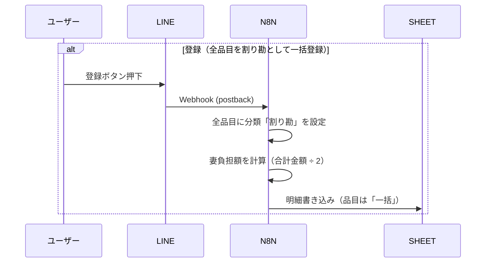

# 基本設計書 改善計画

> このドキュメントは、[BASIC_DESIGN_claude_review_comments.md](./BASIC_DESIGN_claude_review_comments.md) のレビュー指摘に基づく改善計画を記載しています。

---

## 改善項目1: シートレイアウトの列構成拡張

### 現状の課題

品目ごとに仕分けを行う機能があるにもかかわらず、シートレイアウトには以下の列が不足している：

1. **品目（C列）**：どの商品かを記録できない
2. **分類（E列）**：「割り勘」「自分」「妻」のどれに分類したか記録できない
3. **妻負担額（F列）**：清算金額の根拠となる妻の支払い額を記録できない

### 改善案

シートレイアウトを以下のように拡張する：

| 行 | A列（日時） | B列（店名） | C列（品目） | D列（金額） | E列（分類） | F列（妻負担額） |
|---|---|---|---|---|---|---|
| 1 | **日時** | **店名** | **品目** | **金額** | **分類** | **妻負担額** |
| 2 | 2024/12/20 10:30 | スーパーABC | 牛乳 | 200 | 割り勘 | 100 |
| 3 | 2024/12/20 10:30 | スーパーABC | ビール | 500 | 自分 | 0 |
| 4 | 2024/12/22 14:00 | ドラッグストアXYZ | 一括 | 800 | 割り勘 | 400 |
| ... | ... | ... | ... | ... | ... | ... |
| 最終行 | | | | **合計** | | =SUM(F2:F_n) |

> **分類の種類と妻負担額の計算**
> - 割り勘：妻負担額 = 金額 ÷ 2
> - 自分：妻負担額 = 0
> - 妻：妻負担額 = 金額

---

## 改善項目2: 未清算リスト表示に妻負担額を追加

### 現状の課題

表示されている金額が「購入金額の合計」なのか「妻負担額の合計」なのかが不明。

### 改善案

未清算リスト表示を以下のように改善する：

```
【清算額内訳】

2024/12/20 スーパーABC
購入金額：1,800円 → 妻負担：750円

2024/12/22 ドラッグストアXYZ
購入金額：800円 → 妻負担：400円

────────────
妻負担合計：1,150円
```

---

## 改善項目3: セッション管理シートの追加

### 現状の課題

セッション状態（idle / ocr_done / classifying）をどこに保存するかが明記されていない。n8nはリクエストごとにステートレスで動作するため、セッション状態を永続化する仕組みが必要。

### 改善案

Google スプレッドシートに「セッション管理」シートを追加する：

| 列 | 項目 | 説明 |
|---|---|---|
| A | セッションID | LINEユーザーID |
| B | ステータス | idle / ocr_done / classifying |
| C | 品目データ | OCR結果をJSON形式で保持 |
| D | 現在インデックス | 仕分け中の品目番号 |
| E | 最終更新日時 | タイムアウト判定用 |

> **セッション有効期限**
> - 有効期限：24時間
> - 古いセッションは自動削除する

---

## 改善項目4: 「登録」ボタン押下時の処理フロー詳細化

### 現状の課題

シーケンス図の「明細書き込み」部分で、仕分けを行っていない場合にどのような値で書き込むかが不明。

### 改善案

「登録」ボタンは「全品目を割り勘として一括登録」する簡易モードとして定義：



---

## 改善項目5: 「日時」項目の名称変更

### 現状の課題

「日時」という項目名が曖昧で、何の日時を指しているか不明確。

### 改善案

「日時」を「**支払発生日時**」に名称変更する。

| 変更前 | 変更後 |
|---|---|
| 日時 | 支払発生日時 |

> **Status**: [対応完了] BASIC_DESIGN.mdに反映済み

---

## 改善項目6: 登録機能の名称変更と個別登録機能の新設

### 現状の課題

現状の「登録」機能は全品目を割り勘として一括登録する機能だが、名称から動作が明確でない。

### 改善案

#### 6.1 名称変更

| 変更前 | 変更後 |
|---|---|
| [登録] | [一括登録] |

#### 6.2 個別登録機能の新設

クイックリプライボタンは**不要**。LINEのメッセージ欄に以下の形式で入力すると、送信日時を「支払発生日時」として登録する。

**入力形式：**
```
店名
料金
```

**料金の演算対応：**
```
店名
料金+料金     # 加算
料金-料金     # 減算
料金/料金     # 除算
料金*料金     # 乗算
```

**入力例：**
```
コンビニABC
500+300
```

→ 店名「コンビニABC」、金額「800」、支払発生日時「送信日時」として登録

> **Status**: [一部完了]
> - **6.1 名称変更**: スキップ（「レシート登録モード」として別途定義され、名称変更が不要となったため）
> - **6.2 個別登録機能**: 対応完了（フロー一覧、モード一覧、シーケンス図に追加済み）

---

## 改善項目7: フロー終了時の未清算リスト自動表示

### 現状の課題

各フロー終了時に未清算リストの状態が確認できない。

### 改善案

[訂正][仕分け][一括登録][個別登録]のフロー終了時に以下のメッセージを送信する：

**メッセージ1（完了通知）：**
```
完了しました。現時点の未清算リストは以下です
```

**メッセージ2（未清算リスト）：**
```
【清算額内訳】

2024/12/20 スーパーABC
→ 1,500円

2024/12/22 ドラッグストアXYZ
→ 800円

────────────
合計：2,300円
```

> **注意**：完了通知と未清算リストは**別々のメッセージ**として送信する

> **Status**: [対応完了] 各フロー（訂正、仕分け、登録、個別登録）の完了時に未清算リスト表示処理を追加済み
